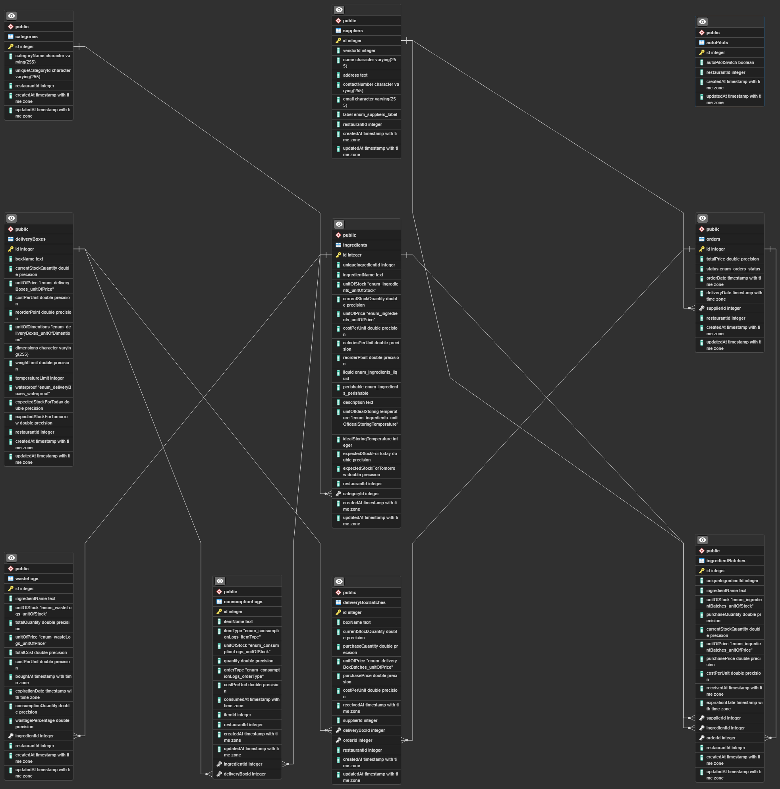

# Bento Inventory Server

Welcome to Bento Inventory Server! This README.md file serves as a guide to understanding the main features of the app, its folder structure, and how to run it on your local machine.

## Main Features

The Bento inventory system is designed to solve critical issues faced by inventory businesses. Here are the main features:

1. **Inventory Ingredients:** View current quantities of ingredients and other relevant details.
2. **Delivery Boxes:** Monitor the quantities of delivery boxes and related features.
3. **Track Wastage:** Record and track wasted ingredients to minimize losses.
4. **Order History:** Access a comprehensive record of past orders made from on-platform suppliers.
5. **Order Status:** Stay updated on the status of pending orders with real-time updates.
6. **My Supplier List:** Manage a list of preferred suppliers, including experience ratings and other pertinent information.
7. **Place Order:** Conveniently order from a list of vendors available on the platform, with search functionality.
8. **Automation of the Order System:** Automatically place orders when ingredient quantities fall below a certain threshold to prevent business disruptions and wastage. Our system employs sophisticated algorithms based on order history to calculate optimal order quantities.

## Folder Structure

```plaintext
.
└── src
    └── controllers
    └── interfaces
    └── middleware
    └── models
        └── autoPilot
        └── category
        └── consumptionLog
        └── deliveryBox
        └── deliveryBoxBatch
        └── ingredient
        └── ingredientBatch
        └── order
        └── supplier
        └── wasteLog
    └── routers
    └── services
    └── utils
    └── config.ts
    └── index.ts
```


## Entity-Relationship Diagram (ERD)




## Getting Started

### How to Run the App Locally

To run the app on your local machine, follow these steps:

1. Clone the repository: `git clone https://github.com/shahriarkhan099/bento-inventory-backend.git`
2. Navigate to the project directory: `cd bento-inventory-backend/server`
3. Install dependencies: `npm install`
4. Create a `.env` file based on the provided `.env.example` file.
5. Fill in the necessary information in the `.env` file according to the example keys provided.
6. Start the server: `npm start`

### Live Link

You can access the live version of the app at [Bento](https://getbento.vercel.app/home). 
1. Go to login
2. Click Sign in by providing email: shahriar.khan099@gmail.com and password: password
3. Finally, Click Inventory silo to access Bento Inventory

### Bento App Info

Our Bento inventory system solves three main issues to avoid business loss. Firstly, it ensures enough ingredients to run restaurants without disabling menus of the restaurant due to insufficient ingredients. Secondly, it helps users to avoid overstocking ingredients which can lead to ingredients wastage. Finally, our inventory system provides on-platform suppliers which will help users to order high-quality ingredients with the lowest price. It prevents users from stocking low-quality ingredients which can cause business loss.
